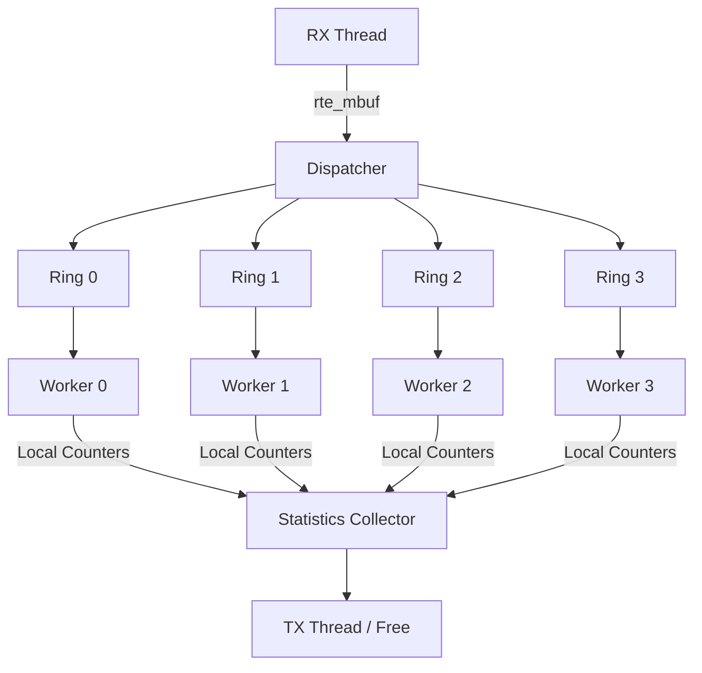
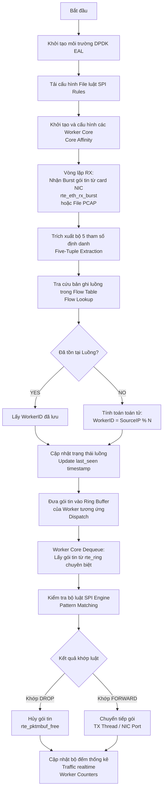

# FlowTable: Hệ thống phân tải luồng và quản lý Flow Table hiệu năng cao sử dụng DPDK

> **MINI PROJECT**
> Tài liệu hướng dẫn triển khai, kiến trúc hệ thống và yêu cầu kỹ thuật dành cho sinh viên thực hiện Mini Project trong lộ trình tối ưu hóa Data Plane hiệu năng cao.

## Mục lục

* [1. Bối cảnh](#1-bối-cảnh)
* [2. Mục tiêu](#2-mục-tiêu)
* [3. Kiến trúc hệ thống](#3-kiến-trúc-hệ-thống)

  * [3.1. Kiến trúc luồng dữ liệu Pipeline](#31-kiến-trúc-luồng-dữ-liệu-pipeline)
  * [3.2. Các thành phần chức năng của hệ thống](#32-các-thành-phần-chức-năng-của-hệ-thống)
* [4. Cơ chế phân tải lưu lượng Load Balancing](#4-cơ-chế-phân-tải-lưu-lượng-load-balancing)
* [5. Cơ chế Flow Affinity](#5-cơ-chế-flow-affinity)
* [6. Quản lý Flow Table](#6-quản-lý-flow-table)
* [7. Thống kê lưu lượng](#7-thống-kê-lưu-lượng)
* [8. SPI Rule Engine Tính năng nâng cao - Optional](#8-spi-rule-engine-tính-năng-nâng-cao---optional)
* [9. Quy trình xử lý chi tiết Flowchart](#9-quy-trình-xử-lý-chi-tiết-flowchart)
* [10. Môi trường thực hành & Kiểm thử](#10-môi-trường-thực-hành--kiểm-thử)
* [11. Kết quả đầu ra yêu cầu Deliverables](#11-kết-quả-đầu-ra-yêu-cầu-deliverables)
* [12. Các tính năng nâng cao Điểm cộng tối đa](#12-các-tính-năng-nâng-cao-điểm-cộng-tối-đa)
* [13. Thông tin liên hệ và Hướng dẫn đồng hành](#13-thông-tin-liên-hệ-và-hướng-dẫn-đồng-hành)

---

## 1. Bối cảnh

Trong các hệ thống mạng hiện đại như Firewall, Load Balancer, CGNAT, UPF trong mạng 5G, Security Gateway hoặc các hệ thống Data Plane hiệu năng cao, việc xử lý lưu lượng trên nhiều CPU Core là yêu cầu bắt buộc nhằm đáp ứng throughput lớn và giảm độ trễ xử lý.

Một trong những bài toán quan trọng nhất trong thiết kế Data Plane bao gồm:

* Phân tải lưu lượng đều lên nhiều CPU Core nhằm tối ưu hóa tài nguyên phần cứng.
* Đảm bảo các packet thuộc cùng một Flow luôn được xử lý trên cùng một Worker (Flow Affinity).
* Giảm thiểu lock và đồng bộ dữ liệu giữa các luồng xử lý để tránh hiện tượng nghẽn cổ chai.
* Tăng hiệu quả sử dụng CPU Cache (L1, L2, L3 cache local), tránh cache miss.
* Duy trì hiệu năng xử lý ổn định ngay cả khi số lượng Flow đồng thời tăng cao lên tới hàng triệu phiên.

Trong thực tế, các hệ thống Data Plane thường xây dựng một cấu trúc dữ liệu gọi là Flow Table để quản lý và theo dõi các phiên lưu lượng đang hoạt động. Khi packet đầu tiên của một Flow xuất hiện, hệ thống sẽ xác định Worker Core phù hợp để xử lý và lưu thông tin này vào Flow Table. Các packet tiếp theo thuộc cùng Flow đó sẽ được tra cứu và chuyển trực tiếp tới Worker đã được gán trước đó mà không cần tính toán lại thuật toán phân tải.

Mini Project này mô phỏng cơ chế Flow Management, Load Balancing và Packet Processing Pipeline được sử dụng trong các hệ thống mạng lõi thực tế bằng cách sử dụng thư viện DPDK (Data Plane Development Kit) để xây dựng hệ thống quản lý Flow tốc độ cao.

---

## 2. Mục tiêu

Mini Project hướng tới xây dựng một hệ thống phân tải lưu lượng hoàn chỉnh và quản lý cấu trúc Flow Table sử dụng thư viện DPDK. Các mục tiêu lõi bao gồm:

* Khởi tạo và cấu hình môi trường lập trình DPDK (EAL, Hugepages).
* Nhận gói tin (packet) trực tiếp từ card mạng (NIC) hoặc giả lập từ file PCAP.
* Phân tích lớp giao thức (Parse Ethernet/IP/TCP/UDP Header).
* Trích xuất thông tin định danh luồng bao gồm Five-Tuple (Bộ 5 tham số).
* Xây dựng và tối ưu cấu trúc dữ liệu Flow Table tốc độ cao.
* Quản lý chính xác vòng đời của một Flow (Khởi tạo, duy trì, timeout và giải phóng).
* Thực hiện thuật toán phân tải lưu lượng tối ưu lên từ 4 đến 8 Worker Thread.
* Đảm bảo tính nhất quán xử lý gói tin thông qua cơ chế Flow Affinity.
* Thực hiện thống kê chi tiết chỉ số lưu lượng realtime theo từng Worker Core.
* Chuyển tiếp (Forward) hoặc giải phóng gói tin sau khi xử lý thành công.
* Xây dựng giao diện hiển thị các thông số giám sát, thống kê hệ thống theo thời gian thực.

Kiến thức và kỹ năng sinh viên sẽ đạt được:

* **Flow-Based Packet Processing:** Tư duy xử lý gói tin dựa trên luồng phiên.
* **Load Balancing trong Data Plane:** Các kỹ thuật phân tải phi tập trung hiệu năng cao.
* **Flow Table Management:** Kỹ thuật tổ chức bộ nhớ, băm (hashing) và quản lý vòng đời dữ liệu.
* **DPDK Programming:** Sử dụng thành thạo các API tối ưu của thư viện DPDK.
* **Multi-threading & Core Pinning:** Lập trình đa luồng tương thích cấu trúc kiến trúc CPU.
* **Lock-free Data Structure:** Ứng dụng cấu trúc dữ liệu không khóa (Lock-free Ring Buffer).
* **Hiệu năng hệ thống mạng tốc độ cao:** Hiểu rõ các yếu tố ảnh hưởng tới Throughput, PPS và Latency.

---

## 3. Kiến trúc hệ thống

### 3.1. Kiến trúc luồng dữ liệu Pipeline

Dưới đây là sơ đồ luồng đi của gói tin bên trong hệ thống FlowCore từ lúc nhận từ phần cứng cho đến khi được phân tải và xử lý tại các Worker Core:



### 3.2. Các thành phần chức năng của hệ thống

#### 1. Packet Receiver RX Thread

Chịu trách nhiệm polling gói tin liên tục từ card mạng (hoặc đọc từ file PCAP thông qua DPDK PCAP PMD). Thành phần này sử dụng hàm API `rte_eth_rx_burst()` để nhận một burst gói tin (tối đa 32 hoặc 64 gói một lần) nhằm giảm chi phí gọi hàm overhead hệ thống.

#### 2. Flow Extractor

Phân tích cấu trúc header của gói tin từ lớp Layer 2 đến Layer 4. Thực hiện bóc tách chính xác bộ 5 tham số định danh (Five-Tuple) bao gồm: Source IP, Destination IP, Source Port, Destination Port, và Protocol.

#### 3. Flow Table Manager

Quản lý vòng đời cấu trúc dữ liệu lưu trữ trạng thái luồng mạng. Định nghĩa cấu trúc bản ghi luồng (Flow Entry) như sau:

```c
typedef struct
{
    uint32_t src_ip;       /* Địa chỉ IP nguồn */
    uint32_t dst_ip;       /* Địa chỉ IP đích */
    uint16_t src_port;     /* Cổng nguồn */
    uint16_t dst_port;     /* Cổng đích */
    uint8_t protocol;      /* Giao thức (TCP/UDP/...) */

    uint8_t worker_id;     /* ID của Worker Core chịu trách nhiệm */

    uint64_t create_time;  /* Thời điểm khởi tạo luồng (TSC) */
    uint64_t last_seen;    /* Thời điểm gói tin cuối cùng xuất hiện */
} flow_entry_t;
```

#### 4. Dispatcher

Thực hiện quy trình tra cứu luồng thông qua cơ chế Lookup Flow Table. Nếu Flow đã tồn tại, trích xuất Worker ID đã gán; nếu là Flow mới, áp dụng thuật toán Load Balancing để chọn Worker thích hợp, tạo bản ghi mới và chuyển gói tin (Dispatch Packet) sang Ring Buffer tương ứng của Worker đó.

#### 5. Worker Processor

Mỗi Worker chạy độc lập trên một CPU Core riêng biệt, liên tục dequeue gói tin từ Ring Buffer của mình. Tại đây gói tin được đưa qua SPI Rule Engine (Bộ lọc luật nâng cao) để đưa ra quyết định Hành vi (Action: Forward hoặc Drop) và đồng thời cập nhật bộ đếm thống kê cục bộ.

#### 6. Flow Aging Thread

Một thread phụ chạy theo chu kỳ (ví dụ mỗi 1 giây) để thực hiện quét (scan) Flow Table, tìm kiếm các Flow hết hạn (Timeout) dựa trên giá trị `last_seen` và giải phóng tài nguyên để tránh tràn bộ nhớ.

#### 7. Statistics Collector

Thu thập các bộ đếm từ các Worker, tính toán các thông số hiệu năng thời gian thực như Throughput (Mbps, PPS), số lượng Active Flow, tỉ lệ tạo/xóa luồng và hiển thị lên màn hình console.

---

## 4. Cơ chế phân tải lưu lượng Load Balancing

Yêu cầu thiết kế đặt ra là phải đảm bảo cân bằng tải tối đa giữa các Worker Thread, duy trì tính nhất quán xử lý gói tin (Flow Affinity) và loại bỏ hoàn toàn cơ chế lock tranh chấp bộ nhớ giữa các Worker nhằm đạt hiệu năng tối ưu cho kiến trúc CPU Multi-core.

Thuật toán phân tải khi một gói tin đầu tiên (First Packet) của một phiên mạng xuất hiện được xác định dựa trên trường Địa chỉ IP Nguồn (Source IP) theo công thức băm đơn giản:

```text
Worker ID = Source IP % N
```

Trong đó `N` là số lượng Worker Core đang hoạt động.

Bảng minh họa phân tải mẫu với hệ thống có `N = 4` Worker (Worker 0, Worker 1, Worker 2, Worker 3):

| Địa chỉ Source IP | Giá trị Số nguyên | Phép toán `SourceIP % 4` | Worker được chỉ định |
| ----------------- | ----------------: | ------------------------ | -------------------- |
| `10.10.10.1`      |       `168430081` | `168430081 % 4 = 1`      | Worker 1             |
| `10.10.10.2`      |       `168430082` | `168430082 % 4 = 2`      | Worker 2             |
| `10.10.10.3`      |       `168430083` | `168430083 % 4 = 3`      | Worker 3             |
| `10.10.10.4`      |       `168430084` | `168430084 % 4 = 0`      | Worker 0             |
| `10.10.10.5`      |       `168430085` | `168430085 % 4 = 1`      | Worker 1             |

---

## 5. Cơ chế Flow Affinity

Flow Affinity (Tính đồng nhất luồng) đảm bảo rằng tất cả các gói tin tiếp theo thuộc cùng một phiên kết nối mạng bắt buộc phải được xử lý bởi duy nhất một Worker Core đã đảm nhiệm gói tin đầu tiên. Quy trình xử lý chi tiết như sau:

1. Khi Flow mới xuất hiện, hệ thống tính toán `Worker ID = SourceIP % N`.
2. Tạo một bản ghi Flow Entry mới (Ví dụ: Flow A -> gán cho Worker 2).
3. Lưu thông tin ánh xạ này trực tiếp vào Flow Table cố định.
4. Đối với các gói tin tiếp theo thuộc luồng này, hệ thống sẽ thực hiện tra cứu nhanh (Lookup) trong Flow Table. Nếu tìm thấy bản ghi, gói tin lập tức được chuyển thẳng tới Worker 2 mà không cần phải chạy lại thuật toán băm IP.

> **Nguyên tắc cốt lõi:** One Flow = One Worker Core. Cơ chế này loại bỏ hoàn toàn việc xáo trộn thứ tự gói tin (Packet Reordering) - một lỗi nghiêm trọng làm suy giảm hiệu năng truyền tải của giao thức TCP.

---

## 6. Quản lý Flow Table

Flow Table là thành phần trái tim của ứng dụng, yêu cầu kiểm soát tài nguyên một cách chặt chẽ thông qua các thao tác cơ bản sau:

### Thêm mới Flow Creation

Khi thực hiện lookup Five-Tuple mà không tìm thấy bản ghi tương ứng trong Flow Table, hệ thống xác định đây là một kết nối mới. Bản ghi `flow_entry_t` mới được tạo, nạp các giá trị trường mạng, thiết lập trường `create_time` và `last_seen` bằng giá trị bộ đếm chu kỳ CPU hiện tại (`rte_get_tsc_cycles()`) và lưu vào bảng băm.

### Cập nhật luồng Update/Keep-Alive

Đối với mỗi gói tin đến sau được định tuyến trúng luồng hiện tại, Worker Processor có trách nhiệm cập nhật lại timestamp trường `last_seen` bằng thời gian thực tế hiện hành. Thao tác này giúp xác nhận luồng mạng vẫn đang trong trạng thái sống (Active).

### Hết hạn luồng Flow Aging & Timeout

> **Quy định nghiệp vụ:** Flow Timeout định mức là 5 giây. Nếu trong vòng 5 giây liên tiếp không có bất kỳ gói tin nào thuộc luồng đó xuất hiện, luồng bị coi là đã kết thúc.

Công thức kiểm tra hết hạn:

```text
if (Current_Time_TSC - last_seen_TSC) > (5 * TSC_per_second) -> Thực hiện DELETE FLOW
```

Yêu cầu chỉ số hiển thị thống kê Flow Table:

| Chỉ số thống kê | Ý nghĩa chức năng                                               | Ví dụ hiển thị mẫu |
| --------------- | --------------------------------------------------------------- | -----------------: |
| Active Flow     | Số lượng luồng hiện đang hoạt động trong bộ nhớ bảng băm.       |                250 |
| Created Flow    | Tổng số lượng luồng đã được khởi tạo từ lúc hệ thống khởi chạy. |              5,000 |
| Deleted Flow    | Tổng số lượng luồng đã bị xóa (chủ động hoặc do hết hạn).       |              4,750 |
| Timeout Flow    | Tổng số lượng luồng bị xóa do cơ chế quá thời gian 5 giây.      |              4,700 |

---

## 7. Thống kê lưu lượng

Mỗi Worker Core sở hữu một cấu trúc dữ liệu đếm độc lập (Lock-free Counters) để đếm gói tin theo thời gian thực dựa trên phân loại tầng ứng dụng. Các loại lưu lượng bắt buộc phải phân loại bao gồm:

| Loại lưu lượng | Điều kiện phân loại dữ liệu Header Match                                   |
| -------------- | -------------------------------------------------------------------------- |
| HTTP           | Giao thức TCP và có Destination Port bằng 80                               |
| HTTPS          | Giao thức TCP và có Destination Port bằng 443                              |
| DNS            | Giao thức UDP và có Destination Port bằng 53                               |
| TCP            | Tất cả gói tin tầng vận chuyển sử dụng Protocol TCP (ngoại trừ HTTP/HTTPS) |
| UDP            | Tất cả gói tin tầng vận chuyển sử dụng Protocol UDP (ngoại trừ DNS)        |
| OTHER          | Các loại giao thức mạng khác còn lại (ICMP, SCTP, v.v.)                    |

Ví dụ dữ liệu hiển thị realtime tại màn hình giám sát cho một Core Worker:

```text
[Worker Core 0 Statistics]
- HTTP Traffic   : 12,000 packets
- HTTPS Traffic  : 25,000 packets
- DNS Traffic    : 5,000 packets
- Total TCP      : 45,000 packets
- Total UDP      : 10,000 packets
- OTHER Traffic  : 300 packets
----------------------------------------
```

---

## 8. SPI Rule Engine Tính năng nâng cao - Optional

Sau khi gói tin được Dispatcher định tuyến tới phân vùng xử lý của Worker Core, trước khi đưa ra quyết định forward, gói tin phải đi qua một bộ lọc luật nông - SPI (Shallow Packet Inspection) Rule Engine để áp dụng các chính sách an toàn thông tin.

Cấu trúc một Rule bao gồm:

* **Rule Name:** Tên định danh của luật (Ví dụ: HTTP_ALLOW, SSH_BLOCK).
* **Five-Tuple Matcher:** Điều kiện lọc dựa trên bộ 5 tham số. Cho phép dấu `*` đại diện cho thuộc tính ANY (bất kỳ).
* **Action:** Hành vi thực thi khi gói tin khớp luật, hỗ trợ: FORWARD (cho qua), DROP (hủy gói), LOG (ghi log hệ thống), COUNT (tăng bộ đếm).

Cú pháp định dạng File cấu hình mẫu (`rules.cfg`):

```cfg
# Format: Rule_Name,Protocol,Src_IP,Dst_IP,Src_Port,Dst_Port,Action
HTTP_ALLOW,TCP,*,*,*,80,FORWARD
HTTPS_ALLOW,TCP,*,*,*,443,FORWARD
DNS_ALLOW,UDP,*,*,*,53,FORWARD
SSH_BLOCK,TCP,*,*,*,22,DROP
DEFAULT,*,*,*,*,*,FORWARD
```

---

## 9. Quy trình xử lý chi tiết Flowchart

Quy trình xử lý tuần tự của một gói tin bên trong hệ thống FlowCore được thực hiện khép kín qua các bước logic chặt chẽ dưới đây:



---

## 10. Môi trường thực hành & Kiểm thử

Để hỗ trợ tối đa cho sinh viên trong điều kiện thiếu thốn thiết bị phần cứng máy chủ vật lý, card mạng chuyên dụng (Intel/Mellanox hỗ trợ DPDK) hoặc máy phát traffic chuyên dụng, Mini Project được thiết kế linh hoạt tương thích hoàn toàn với môi trường máy tính cá nhân.

Cấu hình môi trường khuyến nghị:

* **Hệ điều hành:** Ubuntu 22.04 LTS (Chạy trực tiếp native hoặc qua máy ảo).
* **Phần mềm máy ảo:** VMware Workstation hoặc Oracle VirtualBox.
* **Tài nguyên phần cứng máy tính:** RAM tối thiểu từ 8GB trở lên, CPU hỗ trợ ảo hóa và phân bổ tối thiểu 4 Core cho máy ảo Ubuntu.
* **Cấu hình DPDK:** Sử dụng tối thiểu 1GB Hugepages (cấu hình qua 512 bản kích thước 2MB).

### Chế độ chạy giả lập bằng PCAP PCAP Replay mode

> Hệ thống tích hợp Driver ảo PCAP PMD của DPDK, cho phép đọc chuỗi gói tin liên tục từ file kết xuất `traffic.pcap` thay thế hoàn toàn cho NIC vật lý. Luồng xử lý dữ liệu giả lập diễn ra tuần tự: PCAP Reader -> Dispatcher -> Ring Buffers -> Workers Processing -> Realtime Statistics Display.

---

## 11. Kết quả đầu ra yêu cầu Deliverables

Sinh viên tham gia dự án cần hoàn thiện và bàn giao các hạng mục sản phẩm sau:

### 1. Mã nguồn ứng dụng Source Code

Toàn bộ mã nguồn viết bằng ngôn ngữ C chuẩn, sử dụng thư viện DPDK nâng cao. Code yêu cầu tổ chức tường minh, chia file module hóa rõ ràng (`main.c`, `flow_table.c`, `dispatcher.c`, `spi_engine.c`, `stats.c`) và có chú thích (comment) đầy đủ.

### 2. Tài liệu thiết kế kỹ thuật Design Document

Bản đặc tả chi tiết cấu trúc dữ liệu giải thuật: Sơ đồ thiết kế chi tiết Flow Table, Thuật toán Dispatcher, Nguyên lý hoạt động chi tiết của SPI Rule Engine.

### 3. Bài test & kết quả

* Danh sách testcase cho tính năng – Kết quả tham chiếu
* Danh sách bài test hiệu năng – Kết quả Benchmark

Báo cáo số liệu hiệu năng đo đạc từ hệ thống: Throughput (tính bằng đơn vị pps - Packet Per Second), số lượng Active Flow đồng thời tối đa chịu tải, tỉ lệ phần trăm sử dụng CPU Core và Tốc độ tạo/xóa luồng (Flow rate).

---

## 12. Các tính năng nâng cao Điểm cộng tối đa

Sinh viên có thể triển khai thêm các tính năng nâng cao sau đây để tối ưu hóa điểm số đánh giá dự án:

| Tính năng nâng cao     | Mô tả chi tiết yêu cầu kỹ thuật                                                                                                                   |
| ---------------------- | ------------------------------------------------------------------------------------------------------------------------------------------------- |
| Dynamic Worker Scaling | Khả năng tăng hoặc giảm số lượng Worker Thread linh hoạt ngay trong quá trình hệ thống đang chạy (runtime) mà không làm mất mát gói tin.          |
| Rule Reload Runtime    | Cơ chế reload, nạp lại file cấu hình `rules.cfg` ngay lập tức khi có thay đổi mà không cần phải tắt và khởi động lại ứng dụng.                    |
| Rule Hit Statistics    | Bổ sung bộ đếm số lần khớp (match hit) của từng Rule cụ thể để người quản trị biết luật nào đang được áp dụng nhiều nhất.                         |
| Lock-Free Flow Table   | Sử dụng thư viện khóa nâng cao `rte_hash` kết hợp với cơ chế RCU (Read-Copy-Update) của DPDK để tối ưu hóa tối đa tốc độ truy cập đồng thời.      |
| NUMA Awareness         | Cấu hình phân bổ bộ nhớ mempool, ring buffer trực tiếp trên cùng một NUMA Node với CPU Core xử lý để giảm độ trễ Bus Interconnect.                |
| CLI Realtime Tool      | Xây dựng tập lệnh tương tác nội bộ cho phép gõ các lệnh kiểm tra nhanh trạng thái: `show flow`, `show worker`, `show traffic`, `show statistics`. |
| Dashboard Realtime     | Phát triển giao diện bảng điều khiển trực quan sinh động (Web hoặc Terminal UI) hiển thị biểu đồ đồ thị Active Flow, Throughput, Packet Drop.     |

---

## 13. Thông tin liên hệ và Hướng dẫn đồng hành

Sinh viên sau khi hoàn thành lựa chọn đề tài Mini Project này vui lòng chủ động liên hệ trực tiếp với Mentor phụ trách để nhận được tài liệu hướng dẫn chi tiết, và tham gia các buổi review kỹ thuật định kỳ.

Thông tin Mentor hướng dẫn dự án:

| Thông tin     | Nội dung                                                  |
| ------------- | --------------------------------------------------------- |
| Họ và tên     | Nguyễn Ngọc Dũng                                          |
| Chức vụ       | Chuyên gia tối ưu hóa Data Plane - Viettel Network        |
| Email liên hệ | [dungnn11@viettel.com.vn](mailto:dungnn11@viettel.com.vn) |
