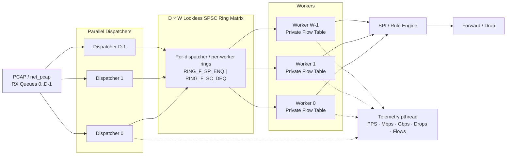

# HPC_FlowTable

High-performance DPDK data-plane prototype for flow-aware packet processing. The project focuses on scaling packet ingestion and per-flow state management using per-worker flow tables, burst processing, and a multi-dispatcher SPSC ring matrix.

## Overview

`HPC_FlowTable` replays traffic from PCAP files through DPDK `net_pcap`, extracts the packet 5-tuple, preserves flow affinity, performs per-worker flow-table lookup and SPI rule matching, then reports real-time throughput statistics.

The optimization path improved end-to-end throughput from about **0.8 Mpps** to **10.85 Mpps**.

## Architecture



All dispatchers use the same deterministic 5-tuple hash, so packets from the same flow are always handled by the same worker. Each worker owns its flow table, avoiding cross-worker locking.

## Features

- DPDK-based packet processing with `net_pcap`.
- Parallel multi-queue packet ingestion.
- `D × W` lockless SPSC dispatcher-to-worker ring matrix.
- Deterministic 5-tuple flow affinity.
- Private per-worker flow tables.
- Hardware-assisted CRC32 hashing via `rte_hash_crc`.
- Burst enqueue/dequeue, bulk hash lookup, and bulk mbuf free.
- SPI/rule-engine packet classification.
- Flow aging and graceful shutdown.
- Real-time and final telemetry for PPS, bandwidth, drops, traffic types, and flow statistics.
- Automatic dispatcher count clamping to the number of available RX queues.

## Prerequisites

Recommended benchmark environment:

- Linux/aarch64 or x86_64.
- GCC and GNU Make.
- `pkg-config`.
- DPDK development libraries with `net_pcap` PMD support.
- libpcap.
- Linux HugePages.
- Root privileges for HugePages/DPDK execution.

Prepare HugePages:

```bash
sudo sysctl -w vm.nr_hugepages=512
sudo mkdir -p /dev/hugepages
sudo mount -t hugetlbfs nodev /dev/hugepages 2>/dev/null || true

grep -i huge /proc/meminfo
```

If stale mappings remain after an abnormal shutdown:

```bash
sudo rm -f /dev/hugepages/rtemap_*
```

## Building

The optimized build uses `-O3 -march=native` and links DPDK through `pkg-config`.

```bash
# Clean previous build artifacts
make clean

# Build
make all
```

Expected executable:

```text
bin/sieucapvip
```

For a full rebuild:

```bash
make clean && make all
```

## Running

### Prepare the benchmark PCAP in RAM

```bash
cp tests/pcap/smallFlows.pcap /dev/shm/smallFlows.pcap
```

### Quick run

```bash
make run
```

### 4 Dispatchers + 4 Workers

```bash
sudo ./bin/sieucapvip -l 0-7 \
  --vdev 'net_pcap0,rx_pcap=/dev/shm/smallFlows.pcap,rx_pcap=/dev/shm/smallFlows.pcap,rx_pcap=/dev/shm/smallFlows.pcap,rx_pcap=/dev/shm/smallFlows.pcap,infinite_rx=1' \
  --no-pci
```

Stop with `Ctrl+C`. The application drains worker rings, performs final flow aging, prints final statistics, and writes detailed worker statistics to `tests/result.txt`.

## Configuration

Main compile-time settings are defined in `include/config.h`.

| Setting | Documented value / role |
|---|---|
| `POOL_NUM_MBUFS` | `131071` for the multi-dispatcher SPSC design |
| `POOL_CACHE_SIZE` | `256` |
| `RX_BURST_SIZE` | `32` |
| `WORKER_RING_SIZE` | `4096` |
| `WORKER_RING_BURST_SIZE` | `32` |
| Flow hash | `rte_hash_crc` |
| Ring mode | Single-producer / single-consumer |
| HugePages | `512 × 2 MB = 1 GB` |

Each RX queue requires one `rx_pcap=` argument. The application queries device capabilities and clamps the active dispatcher count to the number of available RX queues.

Compiler configuration:

```makefile
CFLAGS  = -O3 -march=native -Wall -Wextra -Wformat=2 -Werror=format \
          -I./include $(shell pkg-config --cflags libdpdk) -pthread
LDFLAGS = $(shell pkg-config --libs libdpdk) -pthread
```

## Benchmark

Reference workload:

- `tests/pcap/smallFlows.pcap`: [Download link](https://s3.amazonaws.com/tcpreplay-pcap-files/smallFlows.pcap)
- 9.4 MB
- 14,261 packets
- 1,209 5-tuple flows
- ~646-byte average packet size
- 28 application protocols
- `infinite_rx=1` for sustained replay

Reference machine: Apple M1 Pro, Fedora Linux Asahi Remix 44, GCC 14.x.

| Milestone | Main Optimization | Throughput | Bandwidth | Gain |
|---|---|---:|---:|---:|
| **0. Baseline** | Expanded mbuf pool, telemetry, centralized flow table with `rte_jhash` | ~0.80 Mpps | ~4.13 Gbps | Baseline |
| **1. Hardware CRC Hash** | Replaced `rte_jhash` with hardware-assisted `rte_hash_crc` | ~0.90 Mpps | ~4.65 Gbps | +12.5% |
| **2. Per-Worker Flow Table** | Private flow table per worker; removed centralized contention | ~1.00 Mpps | ~5.17 Gbps | +11.1% |
| **3. Compiler + XOR Dispatch** | Added `-O3 -march=native` and lightweight 5-tuple XOR dispatch | ~1.50 Mpps | ~7.85 Gbps | +50.0% |
| **4. Burst Ring Enqueue** | Replaced per-packet enqueue with `rte_ring_enqueue_burst` | ~2.00 Mpps | ~10.40 Gbps | +33.3% |
| **5. Bulk Lookup + Bulk Free** | Added `rte_hash_lookup_bulk_data` and `rte_pktmbuf_free_bulk` | ~2.07 Mpps | ~10.56 Gbps | +3.5% |
| **7. Multi-Dispatcher SPSC Matrix** | Parallel RX queues with `D × W` lockless SPSC crossbar rings | **10.85 Mpps** | **56.15 Gbps** | **+424.0% vs 2.07 Mpps** |


Multi-Dispatcher SPSC Matrix benchmark:

```text
Packets dispatched: 499,747,072
Packets processed:  498,968,208
Duration:           46.00 s
PPS:                10,847,134.96
Gbps:               56.1479
Average packet:     647.04 bytes
```

Overall throughput increased from approximately **0.80 Mpps / 4.13 Gbps** at baseline to **10.85 Mpps / 56.15 Gbps** with 4 dispatchers + 4 workers, corresponding to approximately **+1256.25%** the baseline packet rate.

These results were measured with DPDK's virtual `net_pcap` PMD and RAM-backed PCAP replay, so they should be interpreted as software data-plane benchmark results rather than physical NIC wire-rate measurements.
